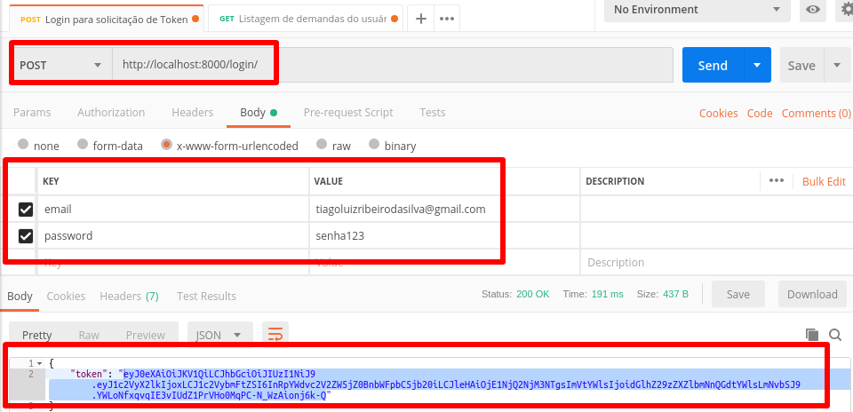
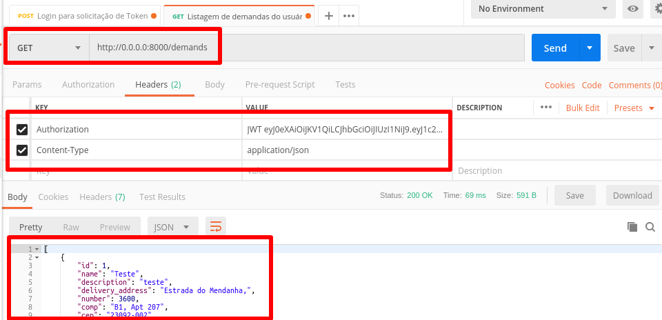

# Cotador de Droids

## Arquivos de configuração
    

Forma criados três arquivos de configuração para esse projeto e mais um arquivo base. Isso foi feito para que possamos ter configurações específicas para cada ambiente. Veja abaixo:


```
droid_quotator
│   README.md
admin
│   │
│   └───settings
│       │   base.py
│       │   development-base.py
│       │   production-base.py
│       │   testing-base.py
│       │   ...
```


Em produção e dev por exemplo temos o banco `postgres`, enquanto no testing, temos o `sqlite3`. Os nomes dos arquivos estão com o sufixo `-base`, pois esses são os arquivos que vão para o repositório. Por motivos de segurança esses arquivos não tem as credenciais de senhas, acessos etc preenchidas, pegue cada arquivo desse crie uma duplicata e retire o nome -base, ficando apenas, development.py, production.py, testing.py e base.py. Deixe os arquivos `-base` da forma que estavam, eles serão base para outros usuários. Agora você tem arquivos de configuração para você usar e ao fazer um commit e push para o repositório os seus arquivos não irão e assim não levarão suas credenciais.


> Não esqueça de preencher campos como `SECRET` e as credenciais do banco de dados que você irá configurar. Ao rodar o projeto com o docker-compose as credenciais que deixei foram usuario='postgres', senha='postgres' e password='postgres'. Não deixe essas credenciais para uso em produção.


## Iniciando a aplicação no Docker


Rode os comandos à seguir na ordem em que estão para poder executar a aplicação utilizando o docker-compose:

Rode este comando para criar os serviços que irão rodar em container. Toda vez que você alterar um arquivo do serviço ou o `Dockerfile` você precisará rodar esse comando novamente:
```console
sudo docker-compose build
```

Agora que tudo está pronto, rode o comando à seguir para rodar os serviços no docker.
```console
sudo docker-compose up
```

Agora com o docker rodando os containers você verá um erro ocorrendo, pois ainda não rodamos a migração. Devido à questão de termos um serviço no django customizado de usuários, precisaremos seguir alguns passos. Entre no container onde está a aplicação rodando, mesmo com erro deixe-a rodando.
```console
docker-compose run web python manage.py makemigrations account
docker-compose run web python manage.py migrate account
docker-compose run web python manage.py makemigrations
docker-compose run web python manage.py migrate
``` 

Se por algum motivo o migrate não funcionar conforme está acima siga os passos abaixo:
```console
sudo docker exec -it CONTAINER_ID bash (Para ver o id do container é só rodar sudo docker container ls)
python manage.py makemigrations account
python manage.py migrate account
python manage.py makemigrations
python manage.py migrate
```

Agora pare e inicie novamente os serviços.
```console
sudo docker-compose down
sudo docker-compose up
```

Abra uma nova aba no terminal e rode o comando abaixo para criar um super usuário para o sistema. Esse usuário terá acesso ao admin e será um super usuário;
```console
sudo docker-compose run web python manage.py createsuperuser
```


## Postman


Para realizar qualquer requisição aos endpoints das demandas é necessário autenticar o usuário antes. Para isso, acesse o endpoint `Login para solicitação de Token de acesso à API` e faça conforme à imagem abaixo:



Pegue o token que foi entregue no resultado da requisição e faça igual à imagem abaixo:


Perceba que no local onde o token se encontra você deverá seguir o padrão:
Exemplo: **JWT eyJ0eXAiOiJKV1QiLCJhbGciOiJIUzI...**

> Todos os endpoints exceto o login exigem esse padrão de cabeçalho.


## Testes unitários


Para rodar os testes unitários execute o seguinte comando:
```console
python manage.py test
``` 

Caso deseje modificar algum teste, cada app do projeto possui um arquivo chamado tests.py é só abrir e editar:

```
droid_quotator
│   README.md
account
│   │   tests.py
admin
│   │   tests.py
demand
│   │   tests.py
pytest.ini
```

O arquivo `pytest.ini` é onde setamos o arquivo de configuração que construirá o banco de dados no sqlite3 para realizarmos os testes.